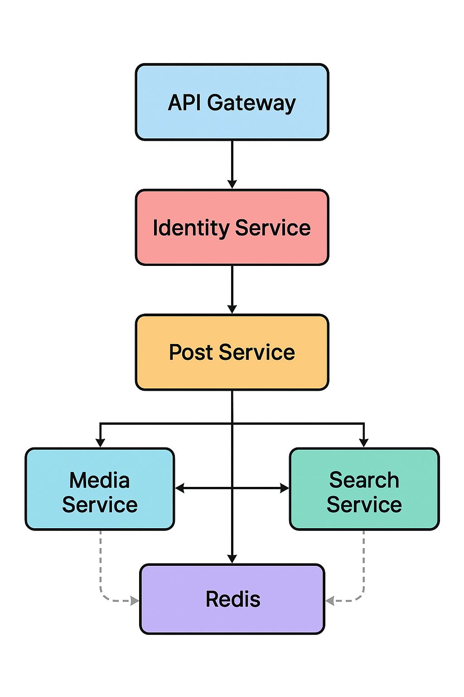

# 📱 Social Media Microservices Backend

This project is a **Microservices-based Social Media Application** built using **Node.js**, **Express.js**, **Redis**, **Docker**, and a **CI/CD pipeline**.  
It follows a distributed services pattern with an **API Gateway** managing client requests and Redis handling caching and inter-service communication.

---

## 🏗️ Architecture

The application consists of the following services:

1. **API Gateway** – Routes client requests to respective microservices.  
2. **Identity Service** – Handles user authentication & authorization (JWT-based).  
3. **Post Service** – Manages user posts (create, update, delete, like, comment).  
4. **Media Service** – Handles file uploads (images/videos).  
5. **Search Service** – Provides search functionality across posts & users.  
6. **Redis** – Used as a cache and message broker for services.  

<p align="center">
  
</p>

---

## 🚀 Features

- **Authentication & Authorization** with JWT  
- **CRUD operations for Posts** (likes, comments included)  
- **Media Uploads** (images/videos) via Media Service  
- **Search Users and Posts** with Search Service  
- **Redis Caching** for faster response times  
- **Redis Pub/Sub** for inter-service communication  
- **Dockerized Services** for easy deployment  
- **CI/CD Pipeline** for automated build & deployment  

---

## ⚙️ Tech Stack

- **Backend Framework**: Node.js, Express.js  
- **Database**: MongoDB  
- **Cache / Messaging**: Redis  
- **API Gateway**: Express Gateway  
- **Containerization**: Docker & Docker Compose  
- **Pipeline**: GitHub Actions (CI/CD)  

---

## 🛠️ Setup & Installation

### 1️⃣ Clone the repository
```bash
git clone https://github.com/BharatKumawat63777/Social-Media-Services.git
cd Social-Media-Services
docker-compose up --build
PORT=3000
JWT_SECRET=your_jwt_secret
MONGO_URI=mongodb://mongo:27017/identity
REDIS_URL=redis://redis:6379
